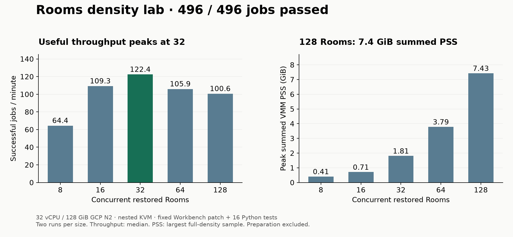

# Rooms cloud experiment results

We ran real nested Firecracker workloads, including 128 simultaneous clones,
portable snapshots, an injected Spot loss and a real Workbench test suite. This
is an experimental readout, not a claim that all ten ideas are finished. Start
with [the reproduction guide](../cloud-lab.md); the [scope tracker](../ten-experiments.md)
keeps the missing agent, GPU and bare-metal work visible.

## Density: more clones eventually stop buying throughput



The host was an n2-standard-32 (32 vCPU, 128 GiB), Intel Cascade Lake, Ubuntu24.04,
in GCP us-east1-b with nested KVM. Each clone applied the same independently
selected patch and ran 16 Python tests at Workbench
`92a706a7982a527ade967e43b68afd4bc1e5d667`.

| Clones | Batch seconds, two trials | Median useful jobs/min | Peak summed VMM PSS, GiB |
|---|---|---:|---:|
|8|7.436 / 7.466|64.4|0.41|
|16|8.835 / 8.737|109.3|0.71|
|32|15.640 / 15.733|122.4|1.81|
|64|36.884 / 35.633|105.9|3.79|
|128|75.596 / 77.124|100.6|7.43|

All 496 clones produced successful receipts and the selected patch digest
`83da8be43c9032f1e44bceeae7a3af135ffe7934ec722963c6d99031feac6c87`.
Runtime identities were unique. Throughput peaked at 32 for this workload,
well before exhausting host memory. Two trials do not establish a stable p99.
The distributions in [readout.json](readout.json) are guest command durations,
not admission-to-ready timings. Preparation is excluded. Bare metal was not run.

## Other results

| Experiment | Observation | Practical implication / limit |
|---|---|---|
|Shared Nix store fallback|112/112 full scans at16/32/64; compressed182.5MiB store resident once, but peak summed VMM PSS10.37/20.73/41.32GiB|virtio-blk still duplicates guest cache; no DAX result|
|File vs userfaultfd|Nine successful trials each; matched copied inputs, disk/tmpfs-never/tmpfs-always medians: File9.055/8.798/8.729s, UFFD9.918/9.746/9.959s|Keep the simpler default for this workload; lazy restore was slower|
|Portable snapshot|371,472,408-byte object; pack18.085s, upload3.335s, download1.599s, unpack/verify8.435s, import3.470s; resumes9.079/9.578s|Same16tests and patch on another matching CPU host; excludes provisioning and arbitrary CPU portability|
|64 mixed hostile workloads|32/32 normal tasks passed; memory7timeouts+1OOM,8diskENOSPC,4immutable-storeEROFS;8bounded process probes finished|Expected failures were retained; this is not a multi-tenant security qualification|
|Network control|Owned endpoint reachable with observe egress, timed out under none, reachable again; server recorded only the two allowed connections|Supports the specific egress result with a positive control; no blanket networking claim|
|GPU|G2/L4 exposed KVM and PCI GPU but no IOMMU; normal VFIO and Cloud Hypervisor launch failed|Hardware blocker; no GPU-in-Room inference and no unsafe passthrough workaround|
|Go CI|Current Workbench100packages partitioned once across32Rooms; both race/coverage runs32/32 green,88.535/90.190s|Reuse timings; base preparation151.811s plus snapshot46.765s; additional7/7 workflow cases passed|
|Spot interruption|Host deleted after patch application before tests; no completion receipt; Fleet checkpoint read on coordinator; fresh Spot host replay passed twice9.273/9.302s|Manual coordinator recovery from a pre-task checkpoint; not automatic failover or recovery of uncheckpointed effects|

Under hostile load the 32 normal commands had p50=19.412s and nearest-rank
p99=21.399s, versus about11.1s p99 for a32-normal-only batch. This describes
neighbor interference; it does not normalize every workload or establish an SLA.
The64-normal-only batches themselves reached about29.3–29.9s p99.

The exact-head GitHub Actions baseline is retained in
[workbench-ci-baseline.json](workbench-ci-baseline.json): run34875289559 had a118s
Go test step and235s overall check job. Hardware, preparation and caching differ.
These measurements do not establish a cost or speed advantage over free public
GitHub Actions. Workbench CI head: `1c0ba652dfc62ae4687d431581d96ece59b314cb`.

## Additional workflow tests

All seven extra matrix cases passed: Fleet reference suite, the pinned Codex
adapter suite, build/vet plus tracelens corpus, and four ledger fuzz targets at
500,000 executions each. These ran in separate Rooms with egress disabled and
model inference off. The seven-case batch took60.529s, separate from the32-shard Go timings above.
This does not recreate every GitHub Actions lint/service/artifact-upload job.

## Failures are part of the recipe

The raw packet includes the first incorrect network geometry, a missing host
sampler utility, copied snapshot ownership rejection, two unsuccessful lazy-loader
versions, and CI setup failures. The corrected lazy loader must survive for the
whole VM lifetime, not just the initial readiness handshake. The first CI run
exposed a production bug: ordinary warm-command stdout corrupted the provisioning
acknowledgement. The patch routes warm stdout to stderr and adds a Linux regression. A newly built image subsequently completed a noisy Go/Codex/Python warm-up and snapshot without redirecting its stdout in the workload.
The second CI run lacked `gh` in its offline toolstore; adding the executable made
both subsequent Go runs green. These are different failures, not flaky retries.

Actual model decision branches and two scoped in-Room agent peers remain pending
operator clarification under the request to keep model usage restricted to this
coordinator. The GPU and bare-metal work remains incomplete. The fixed-patch pilot
is useful control data, not a substitute for those experiments.

## Reuse and evidence

`examples/cloud-lab.rs` is the reusable Rust clone runner. It records exact input
hashes, invocation, raw guest results, memory samples and host cleanup checks.
It was compiled, tested and run on the cloud host at1and2clones (3/3 passed).
`examples/lab-import-snapshot.rs` verifies a transferred snapshot and explicitly
claims its frozen slot on a fresh host. Both are examples rather than a new service.

The original provider and experiment recipes are retained under
`scripts/cloud-experiments/recipes`; they name historical lab paths and
must be adapted. Density and UFFD changes are explicit research patches; production
clone limits remain8. UFFD code derives from Firecracker's Apache-2.0 example;
its source and license are retained. The checked-in handler lockfile was generated
after the initial measurement; it is not claimed as the original binary's build input.

Archives contain logs, receipts and public source/test artifacts. Snapshot memory,
backing images, private keys and signed URLs are deliberately excluded. Verify
archive checksums before extraction. Every public benchmark should travel with
its machine, workload, input identity, preparation cost and unresolved limits.


## Cleanup and cost

The [final inventory](cleanup.json) found zero lab instances, disks, reserved
addresses, cloud snapshots and buckets. The temporary transfer service account
and east-region subnet were deleted. The pre-existing SSH firewall/network and
USD50 billing-alert budget remain; a budget alert is not an active workload or
an enforced spend cap. Every compute host had a provider deletion deadline and
was explicitly deleted after its evidence was exported.

The run is estimated belowUSD10 against the operator's USD50 total authorization;
this is a conservative estimate, not a reconciled billing total. The main32-vCPU
host ran for about100minutes. Storage, transfer and final billing should be checked
before quoting an exact dollar result. No idle test VMs remain to accumulate cost.

The [main archive](main-evidence.tar.xz) contains6,305 individually hashed files;
every member was checked after download. It is about2.5MB using xz compression.
Other archives cover the first pilot, GPU probe, travel, Rust runner smoke and
Spot recovery. [SHA256SUMS](SHA256SUMS) binds each downloadable archive. The main
archive includes `public-evidence-manifest.json` for per-file verification.

```sh
shasum -a 256 -c SHA256SUMS
mkdir evidence
tar -xJf main-evidence.tar.xz -C evidence
```
